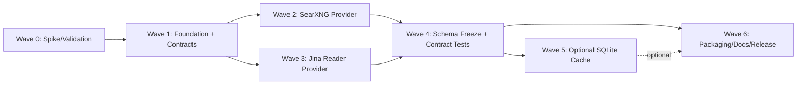

# Researcher MCP Plan (Local-First)

This document is the planning source of truth for the next iteration of the local-first Researcher MCP project.
It is intentionally written to be convertible into task-wave execution later, without modifying existing `vault/sprint/` artifacts.

## Product Direction (Approved)

- Runtime: TypeScript on Node.js
- Interface: OpenCode-first MCP stdio server
- v1 providers: self-hosted SearXNG plus self-hosted Jina Reader (`jina-ai/reader`)
- Output: optimized for AI ingestion, structured and provenance-forward
- Content policy: full content by default; excerpt or truncation only when explicitly requested
- Dedup: request-scoped deduplication by default
- Cache: optional SQLite cache in v1, off by default
- Packaging goal: runnable via `npx` or `pnpm dlx`

## Planning Goals

- Make the first valuable thin slice obvious and shippable.
- Make dependencies explicit so work can run in parallel.
- Keep v1 scope tight: two providers, AI-ingestion outputs, correctness first.

## Wave Overview

| Wave | Objective | Primary Deliverables | Depends On | Notes |
|---:|---|---|---|---|
| 0 | Spike and validation | MCP server runs locally; configured endpoints reachable; sample outputs validated for AI ingestion; risk list updated | - | Critical path; fastest learning loop |
| 1 | Foundation plus provider contracts | Stable tool contracts; provider interface boundary; consistent response schema; request-scoped dedup policy defined | 0 | Critical path; unlocks provider parallelism |
| 2 | SearXNG provider v1 | Search tool returns normalized results with provenance and common failure handling | 1 | Parallel with Wave 3 |
| 3 | Jina Reader provider v1 | Read tool returns full extracted content by default with explicit truncation or excerpt support | 1 | Parallel with Wave 2 |
| 4 | Schema freeze plus contract tests | v1 response shapes frozen; contract tests cover both providers and tools; error taxonomy stabilized | 2, 3 | Critical path for packaging |
| 5 | Optional SQLite cache | Cache can be enabled; respects TTL and invalidation; does not change behavior when disabled | 4 | Optional; should not block release |
| 6 | Packaging, docs, release | `npx` or `pnpm dlx` runnable; concise docs; versioning and release checklist | 4 (and 5 if included) | Release hardening |

## Dependency Graph

## Critical Path

1. Wave 0 validation proves local execution, endpoint connectivity, and sample AI-ingestion output.
2. Wave 1 locks tool names, input parameters, response schema, and dedup/truncation policy.
3. Wave 2 and Wave 3 complete minimum viable provider correctness.
4. Wave 4 freezes schemas and contract tests.
5. Wave 6 finishes packaging and docs for distribution.

## Parallelism Notes

- After Wave 1, Wave 2 and Wave 3 should execute in parallel.
- Wave 4 can start late during Wave 2 and 3 once response shapes converge, but final freeze depends on both providers.
- Wave 6 docs and packaging can begin as drafts earlier, but should not finalize before Wave 4.
- Wave 5 cache is optional; if included, it should be feature-flagged and non-blocking for Wave 6.

## First Valuable Thin Slice (Wave 0)

In a fresh local environment, a user can run the MCP server and successfully:

- Perform a search against a configured SearXNG endpoint and get a structured, provenance-forward response.
- Read a URL via a configured Jina Reader endpoint and get full extracted content.
- Confirm dedup and truncation behaviors via explicit inputs.

### Success Signals

- The server operates over stdio without protocol noise.
- Responses are stable, machine-ingestible, and include enough metadata for downstream AI agents.
- Known risks are enumerated, including auth or proxy issues, rate limits, endpoint quirks, and content-size constraints.

## Risks and Watch Items

- Endpoint variability: SearXNG and Reader deployments vary; validation must cover common configuration differences.
- Content size: full-content default can produce large payloads; truncation must be explicit and clearly signaled.
- Dedup correctness: request-scoped dedup must be deterministic and explainable.
- Packaging: `npx` and `pnpm dlx` distribution must not require manual build steps.

## Migration Path To Task-Waves

- Use `docs/RESEARCHER_MCP_TASK_SKELETONS.md` as the canonical backlog draft.
- When ready to execute, mint real task IDs and copy each skeleton into the task-wave system.
- Run a quick gap check first: some capabilities may already exist in the repo, and tasks should then become verification and completion tasks rather than reimplementation.
